# Linkora

Save, organize, and sync your links between Android, desktop, and web. Whether you're quickly
bookmarking something or managing a structured folder hierarchy with tags, Linkora handles it all
with optional self-hosted sync.

A browser extension is available for saving web links directly to Linkora via the sync-server.

> Linkora on web is currently
> experimental. [linkora-app.netlify.app](https://linkora-app.netlify.app) is the only site maintained
> by me. Anything else is unrelated.

Other repos in the Linkora ecosystem:
[sync-server](https://github.com/LinkoraApp/sync-server) | [browser-extension](https://github.com/LinkoraApp/browser-extension) | [proxy](https://github.com/LinkoraApp/proxy)

**Contributing?** See
the [Contributing Guide](CONTRIBUTING.md) | [Code of Conduct](https://github.com/LinkoraApp/.github/blob/main/CODE_OF_CONDUCT.md)

## Download

 

&nbsp;&nbsp;&nbsp;

Get it on Arch Linux:

 

## Features

- **Unlimited folders and subfolders** with tag support and easy copying/moving of links & folders
  between them
- **Multiple view layouts** (Grid, List, Staggered views) with AMOLED theme support
- **Highlight important links** and archive old ones for clean organization
- **Customize link metadata** and auto-recognize images/titles from web pages
- **Share from other apps** (Android) and add folders to **_Panels_** for quick access
- **Sort, search, import/export** data in JSON and HTML formats with **auto-backups**
- **Keep your data in sync across devices** with
  optional [self-hostable sync-server](https://github.com/LinkoraApp/sync-server)

[How sync works (Technical write-up)](https://sakethpathike.github.io/blog/synchronization-in-linkora) · [Server setup instructions](docs/ServerConnectionSetup.md)

## Screenshots

### Mobile

|                    |                    |                    |                    |
|--------------------|--------------------|--------------------|--------------------|
| 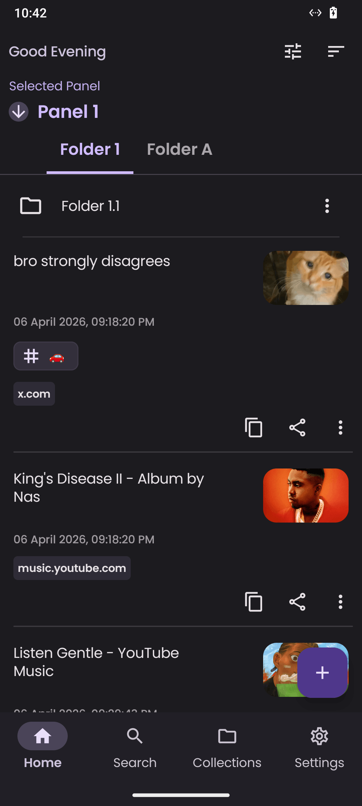 | 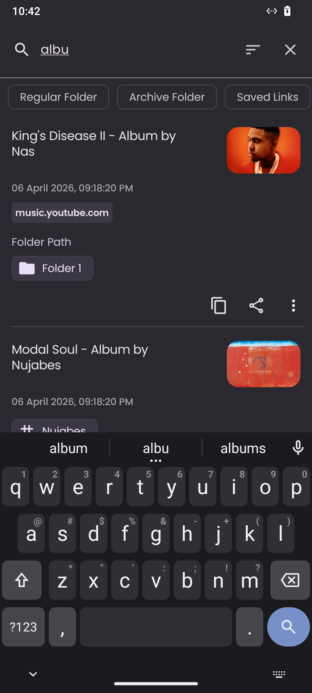 | 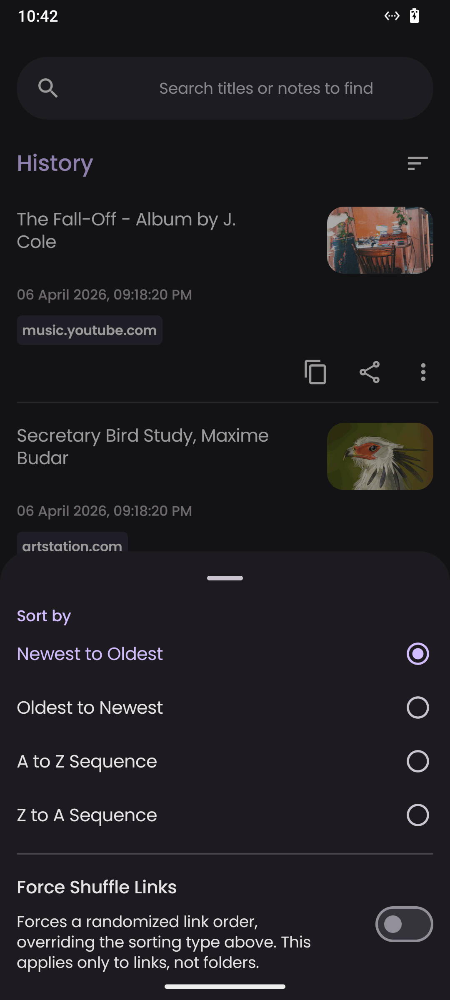 | 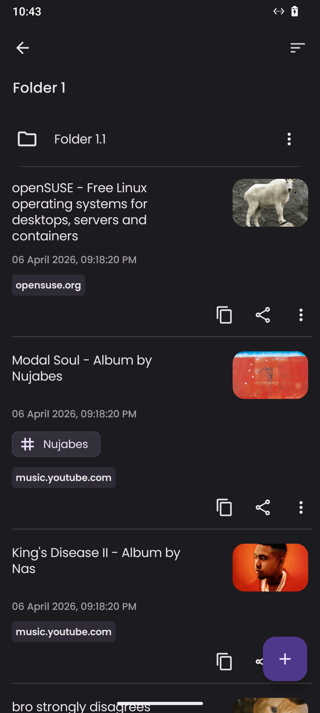 |
| 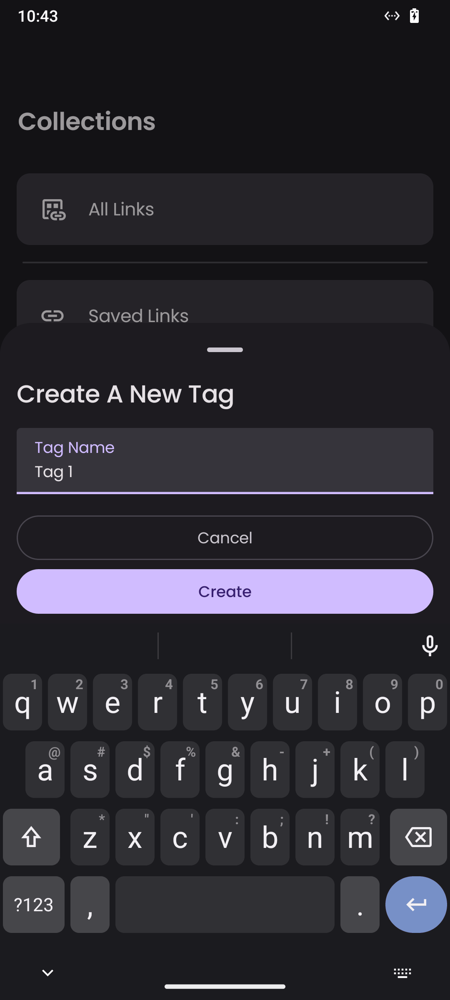 | 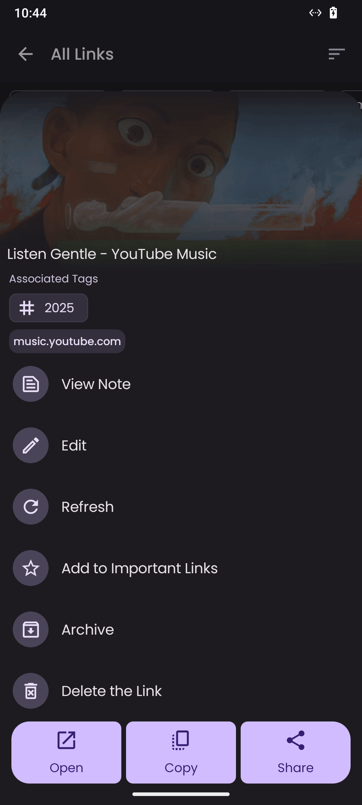 | 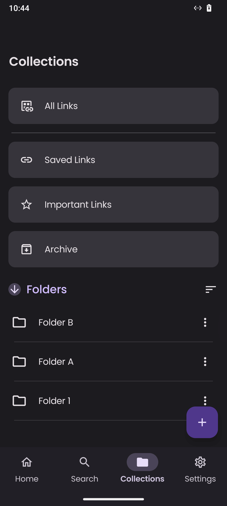 | 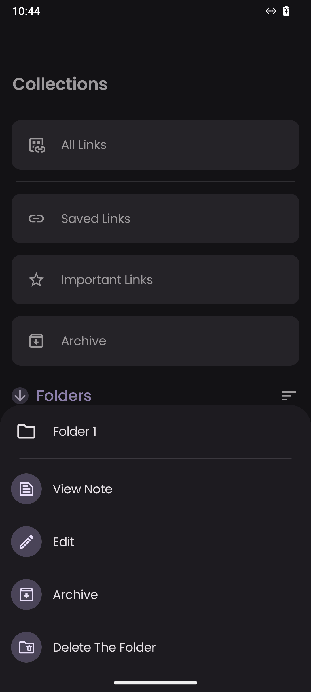 |

### Desktop

|                    |                    |
|--------------------|--------------------|
| 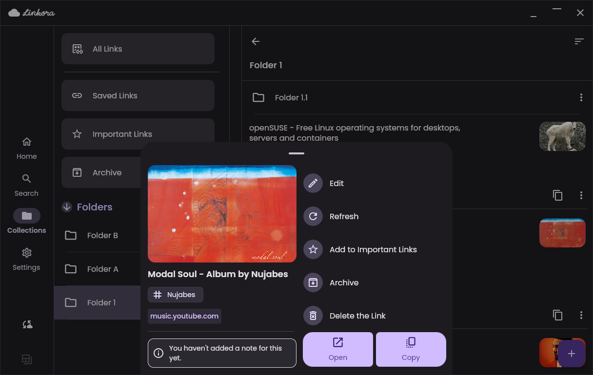 | 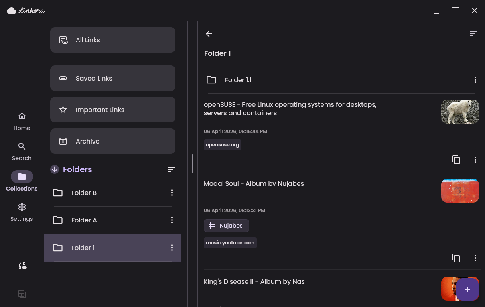 |
| 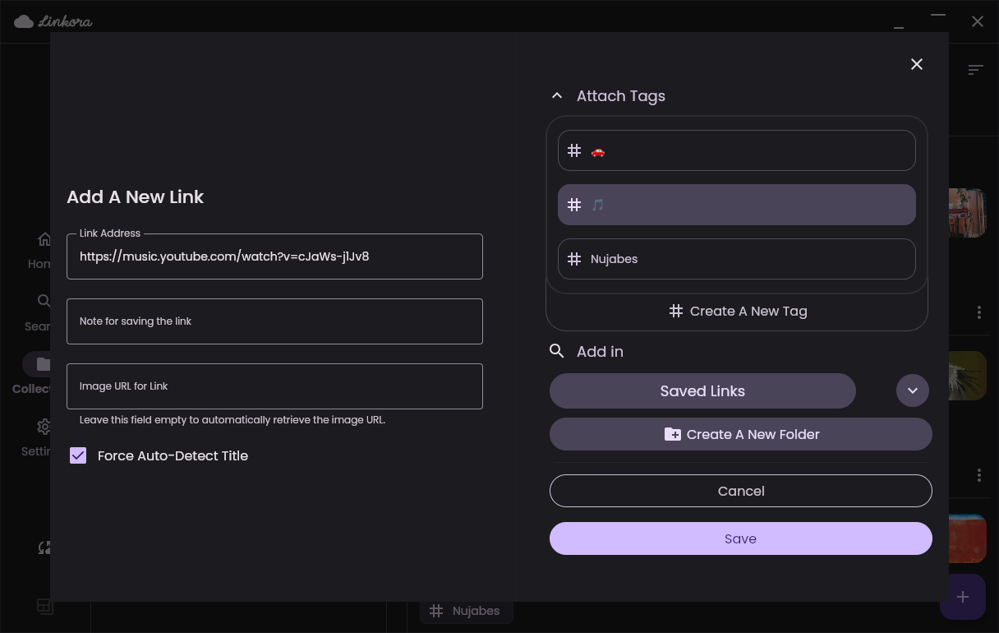 | 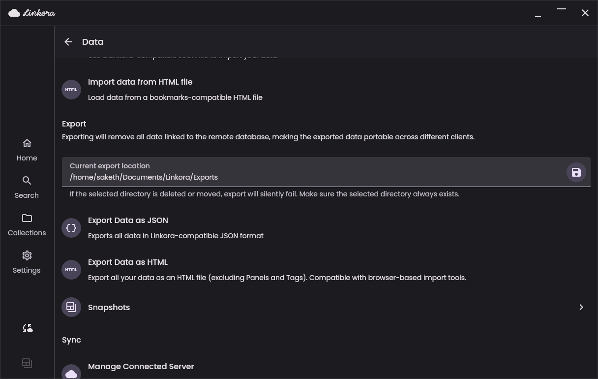 |

## Built with

- Kotlin Multiplatform + Compose Multiplatform + Material 3
- SQLite with Room (local storage) + Ktor (networking) + Custom cursor-based reactive and
  resource-aware paginator
- Coroutines and Flows for async operations
- [Ksoup](https://github.com/fleeksoft/ksoup) for HTML parsing and metadata extraction
- [Coil](https://github.com/coil-kt/coil) for image loading
- Custom syncing mechanisms for handling syncing with remote server
- [Android-specific] WorkManager for snapshots and bulk metadata refresh for links

Full dependency list
in [libs.versions.toml](/gradle/libs.versions.toml).

Linkora's improved UI components are inspired and based on designs created
by [LOLCATpl](https://discord.com/users/494115165927637007) across all platforms. The icon, painted
by [mondstern](https://pixelfed.social/mondstern), is used as the app icon on all platforms and also
on the internet.

### Localization

Linkora supports multiple languages with remote strings that can be updated without requiring an app
update, i.e. over-the-air updates. If you'd like to help translate Linkora into your language or
improve existing translations, please go through
the [localization server](https://github.com/LinkoraApp/localization-server)'s README to learn how
localization is handled and how you can contribute.

## Community

---

**License:** MIT
